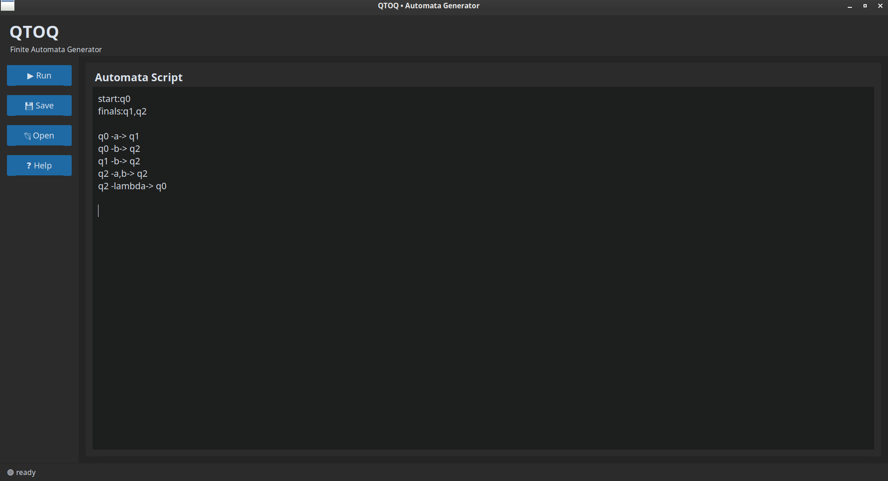
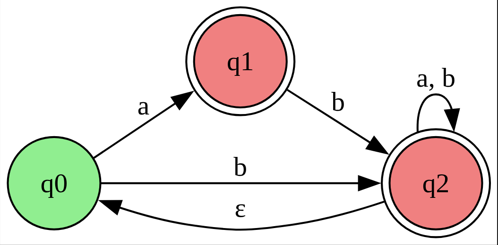

# QTOQ

QTOQ is a lightweight desktop application for describing and visualizing finite automata using a simple text-based language.

Instead of manually drawing state diagrams, users can define states and transitions in a concise DSL (Domain Specific Language), and QTOQ automatically generates a graphical representation of the automaton.

---

## Screenshot

---

## Features

* Simple and human-readable automata description language
* DFA support
* NFA support
* Epsilon (ε) transitions
* Automatic graph generation
* Interactive desktop interface
* Graphviz-powered visualization
* PNG export

---

## Example

Input:

```text
start:q0
finals:q1,q2

q0 -a-> q1
q0 -b-> q2
q1 -b-> q2
q2 -a,b-> q2
q2 -lambda-> q0
```

Generated automaton:

---

## Syntax

### Start State

```text
start:q0
```

### Final States

```text
finals:q1,q2
```

### Transition

```text
q0-a->q1
```

### Multiple Symbols

```text
q0-a,b,c->q1
```

### Epsilon Transition

```text
q0-ε->q1
```

or

```text
q0-lambda->q1
```

---

## Installation

Clone the repository:

```bash
git clone https://github.com/pooyaheiran/qtoq.git
cd qtoq
```

Install dependencies:

```bash
pip install customtkinter pillow pydot
```

Install Graphviz:

### Debian / Ubuntu

```bash
sudo apt install graphviz
```

### Fedora

```bash
sudo dnf install graphviz
```

### Arch Linux

```bash
sudo pacman -S graphviz
```

Run the application:

```bash
python3 main.py
```

---

## How It Works

QTOQ follows a simple pipeline:

```text
User Input
     │
     ▼
   Parser
     │
     ▼
 Structured Data
     │
     ▼
 Graph Generator
     │
     ▼
 PNG Automaton
```

1. The user writes an automata description using the QTOQ DSL.
2. The parser extracts states, transitions, and metadata.
3. A structured representation is generated.
4. Graphviz renders the automaton.
5. The resulting image is displayed in the application.

---

## Project Structure

```text
qtoq/
├── app_ui.py
├── parser.py
├── graph.py
├── main.py
├── screenshots/
└── README.md
```

### app_ui.py

Graphical user interface built with CustomTkinter.

### parser.py

Parses the QTOQ language and converts it into a structured representation.

### graph.py

Generates automata diagrams using Pydot and Graphviz.

### main.py

Application entry point.

---

## Technologies Used

* Python
* CustomTkinter
* Pillow
* Pydot
* Graphviz

---

## Roadmap

Planned features and improvements:

* NFA → DFA conversion
* Better error reporting
* SVG export
* Improved editor experience
* Cross-platform packaging

---

## Why QTOQ?

QTOQ was created as a small educational project for experimenting with:

* Finite Automata
* Language Design
* Parsing
* Graph Generation
* Desktop Application Development

The goal is to make automata creation faster and more accessible through a simple textual notation.
